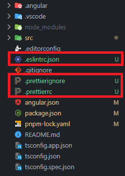
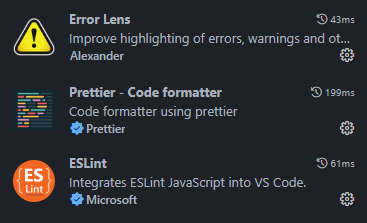
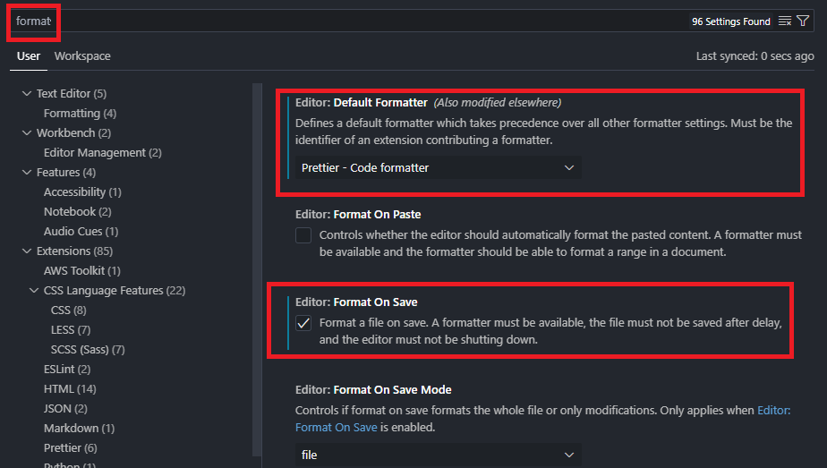

# Configuración de Eslint para Angular 
## Instalación de dependencias
- Angular ESLint
```bash
ng add @angular-eslint/schematics
```
- Prettier y Prettier ESLint
```bash
pnpm add prettier prettier-eslint eslint-config-prettier eslint-plugin-prettier -D
```
## Archivos de configuración
Los siguientes archivos deben ser creados en la raíz del proyecto.



Las reglas aplicadas a esta configuración se pueden ver con más detalle en la documentación oficial de [angular-eslint](https://github.com/angular-eslint/angular-eslint/tree/main/packages/eslint-plugin/docs/rules). 
- **Fichero**: `.eslintrc`
```json
{
  "root": true,
  "ignorePatterns": ["projects/**/*"],
  "env": {
    "browser": true,
    "node": true
  },
  "overrides": [
    {
      "files": ["*.ts"],
      "parserOptions": {
        "project": ["tsconfig.json"],
        "createDefaultProgram": true
      },
      "extends": [
        "eslint:recommended",
        "plugin:@angular-eslint/recommended",
        "plugin:@angular-eslint/template/process-inline-templates",
        "plugin:prettier/recommended"
      ],
      "rules": {
        "@angular-eslint/component-class-suffix": [
          "error",
          {
            "suffixes": ["Page", "Component"]
          }
        ],
        "@angular-eslint/component-selector": [
          "error",
          {
            "type": "element",
            "prefix": "app",
            "style": "kebab-case"
          }
        ],
        "@angular-eslint/directive-selector": [
          "error",
          {
            "type": "attribute",
            "prefix": "app",
            "style": "camelCase"
          }
        ],
        "@angular-eslint/use-lifecycle-interface": ["error"],
        "@typescript-eslint/member-ordering": 0,
        "@typescript-eslint/naming-convention": 0,
        "@angular-eslint/use-injectable-provided-in": ["error"],
        "@angular-eslint/sort-lifecycle-methods": ["error"],
        "@angular-eslint/relative-url-prefix": ["error"],
        "@angular-eslint/prefer-standalone-component": ["error"],
        "@angular-eslint/prefer-output-readonly": ["error"],
        "@angular-eslint/no-lifecycle-call": ["error"],
        "@angular-eslint/no-conflicting-lifecycle": ["error"],
        "@angular-eslint/contextual-lifecycle": ["error"]
      }
    },
    {
      "files": ["*.html"],
      "extends": ["plugin:@angular-eslint/template/recommended"],
      "rules": {}
    },
    {
      "files": ["*.html"],
      "excludedFiles": ["*inline-template-*.component.html"],
      "extends": ["plugin:prettier/recommended"],
      "rules": {
        "prettier/prettier": ["error", { "parser": "angular" }]
      }
    }
  ]
}
```
- **Fichero:** `.prettierrc`
```json
{
  "tabWidth": 2,
  "useTabs": false,
  "singleQuote": true,
  "semi": true,
  "bracketSpacing": true,
  "arrowParens": "avoid",
  "trailingComma": "es5",
  "bracketSameLine": true,
  "printWidth": 80
}
```
- **Fichero:** `.prettierignore`
```plain
dist
node_modules
```
## Instalación y configuración de extensiones para Visual Studio Code
Para obtener ayuda en el IDE se recomienda las siguientes extensiones y configuración
- **Extensiones**



- **Configuración**
Para aplicar las correcciones automáticas (auto fix) al guardar se debe configurar lo siguiente:

+

O en el `settings.json` agragar la siguiente línea
```json
"editor.codeActionsOnSave": {
    "source.fixAll": true
  },
```
## Scripts
Se puede agregar dos script al `package.json` para:
- Listar los archivos que presentan errores del Linter `ng lint`
- Reparar automáticamente los archivos con errores del Linter que sea posible `ng lint --fix`
```js
"scripts": {
  // Otros scripts
  "scripts": {
    "lint": "ng lint",
    "lint-fix": "ng lint --fix"
  }
}
```
